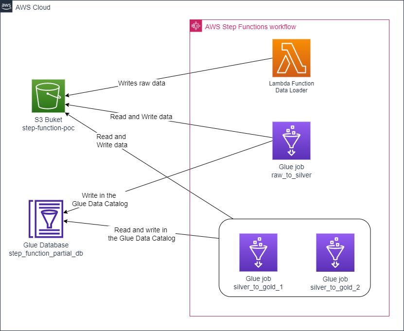
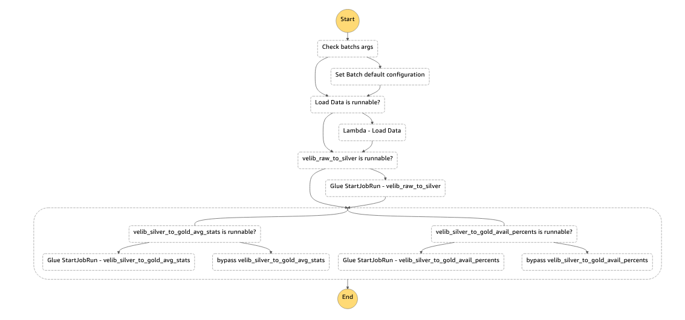
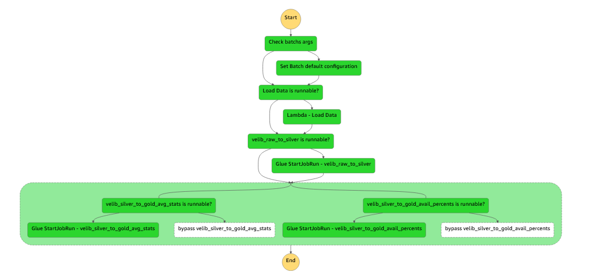
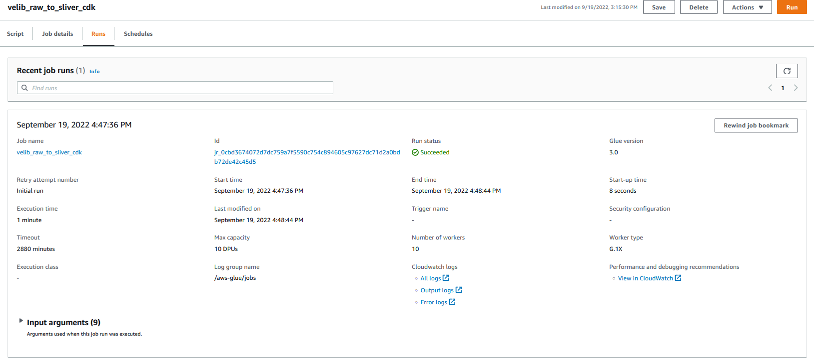
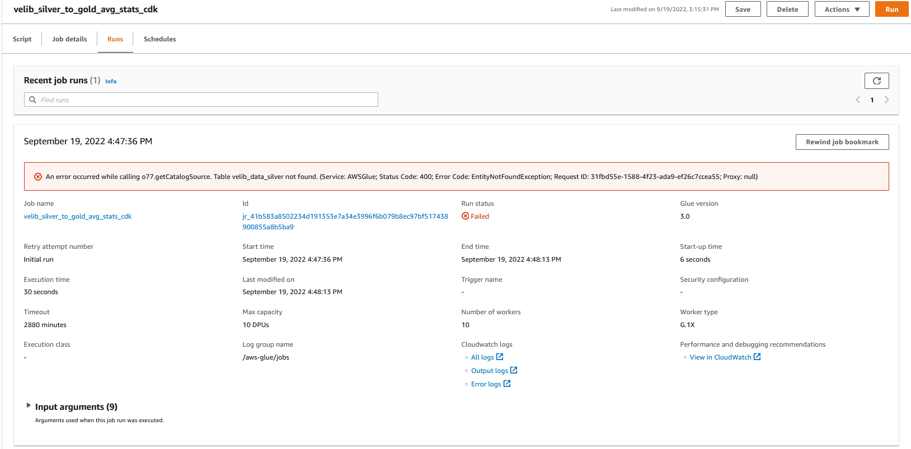
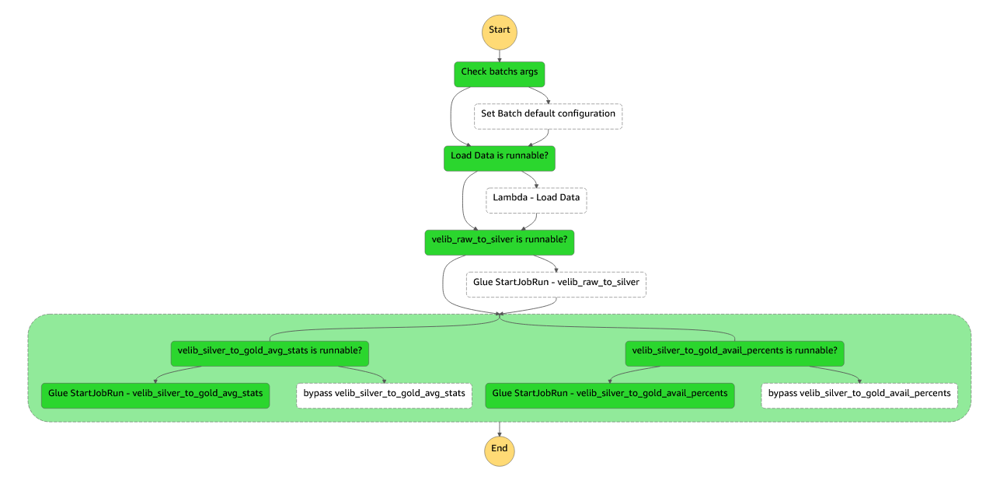
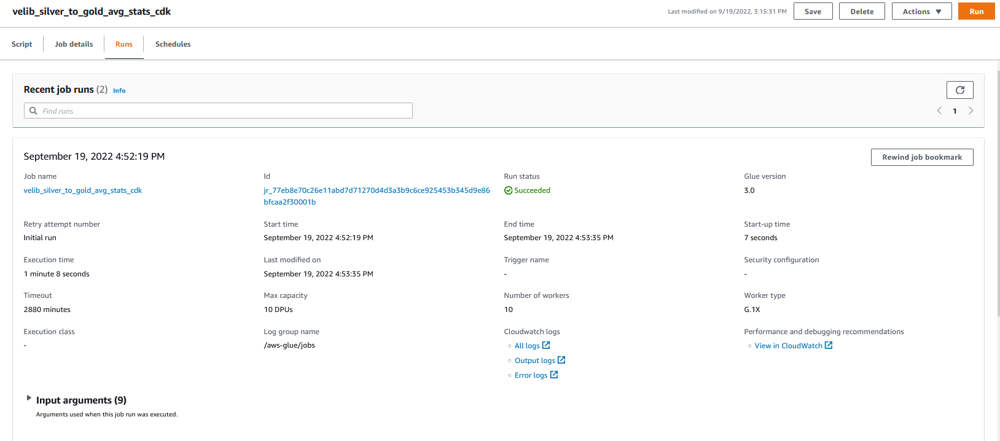
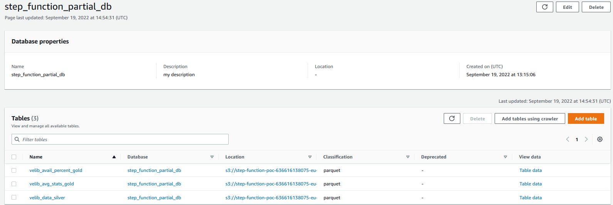

# Deploy AWS Step Functions that supports partial runs

[AWS Step Functions](https://aws.amazon.com/step-functions/?step-functions.sort-by=item.additionalFields.postDateTime&step-functions.sort-order=desc)
is a serverless, AWS-managed workflow service that developers use to
orchestrate their jobs. It provides multiple features such as process parallelization,
error management, observability, service integration, but does not yet provide partial retries (unlike [Airflow](https://airflow.apache.org/docs/apache-airflow/stable/dag-run.html#re-run-tasks)).

This means that whenever a task in your state machine fails, you cannot re-launch this specific task directly from the Step Functions console.
To resume the process, **you need to re-start the state machine execution from the beginning**. This is OK when the error happens
in the fist task of your workflow. But when the error happens in the middle of your workflow, just after you ran a 2 hours process (or more...),
**this is when you regret that Step Functions does not support partial retries.**

This problem is not new, and a [blog post](https://aws.amazon.com/blogs/compute/resume-aws-step-functions-from-any-state/)
has already been written on this topic. But the implementation of this blog is quite heavy, and data engineers should expect something
simpler when fixing their workflows.

This repository presents **a simple way to build a state machine which supports partial retries**. There is still some custom logic to
code to enable this feature on your state machines, but it could be an efficient workaround while we are waiting for the AWS Step Functions
service team to deliver this feature (which is, again, available for years in Airflow).

## Solution overview

This CDK code deploys the architecture summarized in the diagram below



It notably includes:
* **An S3 bucket**: This bucket stores the Glue scripts. It is also used by the Lambda function and the Glue jobs as the data storage solution.
* **A Glue database**: This database is used to organise all metadata tables produced by this example. In this case, tables define data
  stored in Amazon S3.
* **A state machine**: This workflow is made of 4 steps:
    * A **Lambda function** that generates raw data in S3 by calling a public API.
    * A **Glue job** that transforms raw data into silver data.
    * Two **Glue jobs** that run in parallel. Each of them read from the silver dataset and generate a gold dataset for 
    data analysts to consume.
      
Now let's look more closely at the step machine deployed



As you can see, before each task (the lambda function and the 3 glue job), the state machine checks whether it has to execute the task.

The logic is as follows:
* If no arguments is specified when triggering the state machine, then **all tasks are executed**.
* The data engineer can **optionally indicate which tasks to run when executing the step machine**. 
  For that, it has to provide this execution input to the state machine (only tasks that are set to `true` are executed:
```json
{
  "lambda_load_data": false,
  "velib_raw_to_silver": false,
  "velib_silver_to_gold_avg_stats": true,
  "velib_silver_to_gold_avail_percent": true
}
```

You will go through a concrete implementation of this logic in [Test partial retries on the state machine](#test)

## Code deployment

#### Pre-requisites

For this deployment, you will need:
* An AWS account with sufficient permissions to deploy AWS resources packaged in this code.
* aws-cdk: installed globally (npm install -g aws-cdk) 
* git client

> :warning: **Lake Formation disclaimer**: This architecture works if Lake Formation is not activated in your AWS environment. 
> If you are using Lake Formation to manage access to Glue databases, then the Glue jobs might fail because of a permission issue.
> In this case you need to edit Glue role permissions in Lake Formation, and grant read/write to the Glue database. 

#### Clone the repository
Clone the GitHub repository on your machine:

```bash
git clone https://github.com/louishourcade/step_function_partial_runs.git
cd step_function_partial_runs
```

#### Configure your deployment

Edit the `app.py` file with information about your AWS account:

```python
aws_acccount = "AWS_ACCOUNT_ID"
region = "AWS_REGION"
```

This is the AWS environment where the resources will be deployed.

#### Bootstrap your AWS account

If not already done, you need to [bootstrap your AWS environment](https://docs.aws.amazon.com/cdk/v2/guide/bootstrapping.html) before deploying this CDK application.

Run the commands below with the AWS credentials of your AWS account:

```bash
cdk bootstrap aws://<tooling-account-id>/<aws-region>
```

#### Deploy the CDK application

Now that your AWS account is bootstrapped, and that you configured your WAF deployment, you can deploy the CDK application with the following command:

```bash
cdk deploy AWSStateFunctionPartialRuns
```

Confirm the deployment in the terminal, wait until the CloudFormation stack is deployed, and you're done 🎉

## Test partial retries on the state machine <a name="test"></a>

In this section, we test the resources we deployed, and we will see how to partially run the state machine.

#### First execution of the state machine

Open the AWS State Functions console, select the **velib-demo** state machine, and click on **New execution**. Do not provide any execution input,
this will trigger all tasks in the workflow. Wait a few minutes until the end of the workflow.



As you can see from the execution visual representation above, all tasks (the Lambda function and the 3 Glue jobs) were executed.
But what you see in green for the Glue job is **the triggering of the execution only**. Which means that even if it appears in green in the state machine visual representation (the glue job started successfully),
it might have actually failed 😥...

Let's check the status of each Glue job. Open the AWS Glue console, and start by looking at the execution history of the first Glue job: **velib_raw_to_sliver_cdk**



Hoora! this first job was successful 🥳

Now let's look at the other Glue jobs



Oh no ! These jobs failed. But why ???

When you look at the logs, you will see that it complains that the **velib_data_silver** table is missing. This table is the output of the first Glue job.
So this error message makes perfect sense, it happened on the first execution because the **silver_to_gold** Glue jobs were triggered before the end
of the execution of **silver_to_gold** Glue job.

We can fix this issue by running only the last tasks of the state machine, which failed in our first execution.

#### Partial run of the state machine

Go back to the AWS Step Functions console, and execute **velib-demo** one more time. But this time, provide the following execution input:

```json
{
  "lambda_load_data": false,
  "velib_raw_to_silver": false,
  "velib_silver_to_gold_avg_stats": true,
  "velib_silver_to_gold_avail_percent": true
}
```

Wait a few seconds until the execution is over.



You can imediately see the difference with the first execution of the state machine. In this case, **the two first tasks did not run**.
This is due to what you defined in your execution input. This new execution only executed the last two tasks.

Go back to the AWS Glue console and check the status of the Glue jobs. All of them should have succeeded now!



And if you open the Glue database console, you will see the three tables produced by our workflow.



## Next steps

This code provides you with a working example that illustrates how you could enable partial retries on your state machines.
It requires to implement some custom logic when defining the state machine, but in the end it is pretty easy for the end user to partially run their workflows.
As mentioned at the top of this document, **partial retries are available in Airflow for a long time**. So there is hope that AWS
will release a new Step Functions feature to catch up.
